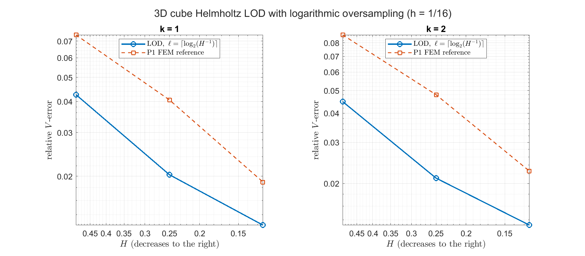
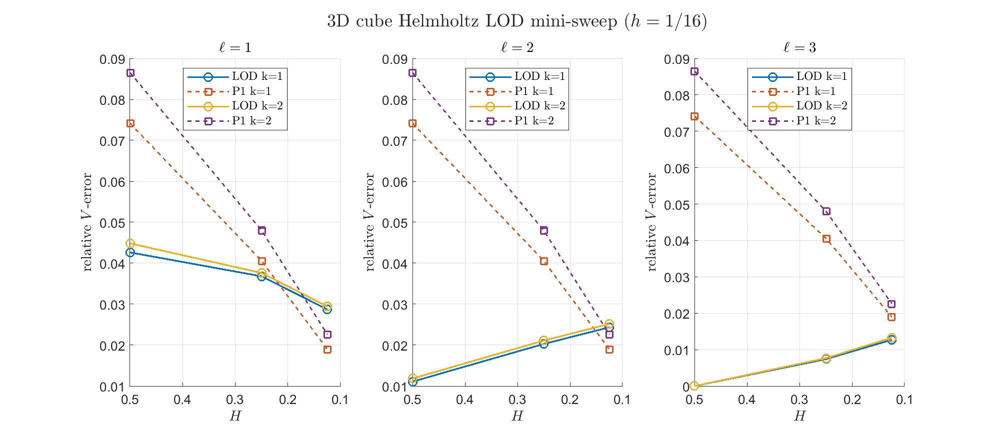

Reproduction target: 3D cube Helmholtz LOD construction mini-sweep.
Created: 2026-05-27
Updated: 2026-05-27
Verification entry point: `verify/verify_lod_helmholtz3d_cube_sweep.m`
Main utilities: `buildLODHelmholtz3D`, `weightedClementP1`, `assembleHelmholtz3D`

# LOD Helmholtz 3D Cube Mini-Sweep

This run checks the 3D tetrahedral LOD construction on `Omega=(0,1)^3` with homogeneous impedance boundary conditions. It is a small construction and behavior check, not a full Peterseim reproduction.

Fine mesh rule: Lagrange degree `p=1`, `k_max=2`, require `h^{-1} >= 5.65685` from `h = O(k^{-(2p+1)/(2p)})`; nested run uses `h=1/16`.

Default run: `h=1/16`, `H^{-1}=[2  4  8]`, `k=[1  2]`, `ell=[1  2  3]`.

Corrector solver mode: `direct`. `direct` uses MATLAB sparse backslash for the local constrained saddle systems; `lu` uses explicit `decomposition(...,'lu')` factor reuse for paired primal/adjoint solves.

Oversampling policy: `cross-log2-hinv`. The default `ell` list is derived from `ceil(log2(H^{-1}))`; the full table is still combinatorial so the diagonal rows `ell=ceil(log2(H^{-1}))` can be compared against larger oversampling.

Patch coverage diagnostic: fixed `ell` does not imply comparable effective localization across different `H`. Use the full patch count and mean patch fraction columns to identify rows that are global-corrector cases or rows whose localized patches are much smaller than the coarser-mesh comparison.

## Log-Oversampling Trend

The following figure compares the diagonal choice `ell=ceil(log2(H^{-1}))` against the P1 FEM reference as `H` decreases.

## Full Combinatorial Sweep

## Data

| k | H^{-1} | ell | LOD | best LOD | stabilized | P1 | full patches | mean patch fraction | seconds |
|---:|---:|---:|---:|---:|---:|---:|---:|---:|---:|
| 1 | 2 | 1 | 4.263228e-02 | 4.231680e-02 | 7.915448e-02 | 7.416751e-02 | 0/48 | 0.536 | 4.10 |
| 1 | 2 | 2 | 1.107441e-02 | 1.106376e-02 | 8.126594e-02 | 7.416751e-02 | 24/48 | 0.917 | 5.34 |
| 1 | 2 | 3 | 2.705743e-15 | 7.093211e-15 | 8.094248e-02 | 7.416751e-02 | 48/48 | 1.000 | 6.08 |
| 1 | 4 | 1 | 3.680212e-02 | 3.639634e-02 | 4.167695e-02 | 4.057653e-02 | 0/384 | 0.116 | 5.63 |
| 1 | 4 | 2 | 2.028494e-02 | 2.026205e-02 | 4.256674e-02 | 4.057653e-02 | 0/384 | 0.390 | 13.47 |
| 1 | 4 | 3 | 7.412023e-03 | 7.408776e-03 | 4.232980e-02 | 4.057653e-02 | 0/384 | 0.693 | 23.63 |
| 1 | 8 | 1 | 2.870568e-02 | 2.849988e-02 | 1.905982e-02 | 1.896028e-02 | 0/3072 | 0.018 | 13.05 |
| 1 | 8 | 2 | 2.434693e-02 | 2.431369e-02 | 1.933535e-02 | 1.896028e-02 | 0/3072 | 0.078 | 33.83 |
| 1 | 8 | 3 | 1.271552e-02 | 1.271332e-02 | 1.917966e-02 | 1.896028e-02 | 0/3072 | 0.181 | 69.58 |
| 2 | 2 | 1 | 4.484473e-02 | 4.428858e-02 | 8.868677e-02 | 8.653489e-02 | 0/48 | 0.536 | 4.00 |
| 2 | 2 | 2 | 1.183721e-02 | 1.179517e-02 | 9.066472e-02 | 8.653489e-02 | 24/48 | 0.917 | 5.54 |
| 2 | 2 | 3 | 2.061076e-15 | 2.276773e-15 | 9.039304e-02 | 8.653489e-02 | 48/48 | 1.000 | 5.93 |
| 2 | 4 | 1 | 3.761647e-02 | 3.702359e-02 | 4.896633e-02 | 4.800421e-02 | 0/384 | 0.116 | 5.57 |
| 2 | 4 | 2 | 2.110777e-02 | 2.106182e-02 | 5.038148e-02 | 4.800421e-02 | 0/384 | 0.390 | 13.42 |
| 2 | 4 | 3 | 7.674133e-03 | 7.669075e-03 | 5.010617e-02 | 4.800421e-02 | 0/384 | 0.693 | 23.21 |
| 2 | 8 | 1 | 2.942542e-02 | 2.912632e-02 | 2.272294e-02 | 2.261659e-02 | 0/3072 | 0.018 | 13.56 |
| 2 | 8 | 2 | 2.516792e-02 | 2.509598e-02 | 2.319474e-02 | 2.261659e-02 | 0/3072 | 0.078 | 33.54 |
| 2 | 8 | 3 | 1.327934e-02 | 1.327054e-02 | 2.291629e-02 | 2.261659e-02 | 0/3072 | 0.181 | 68.60 |
