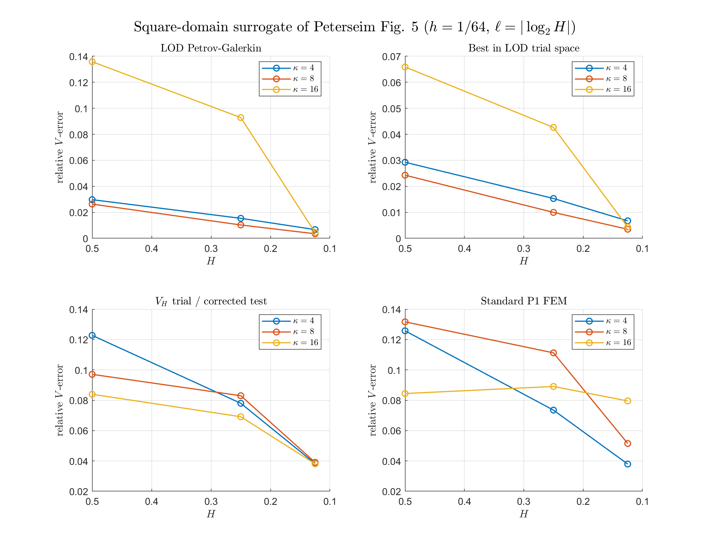
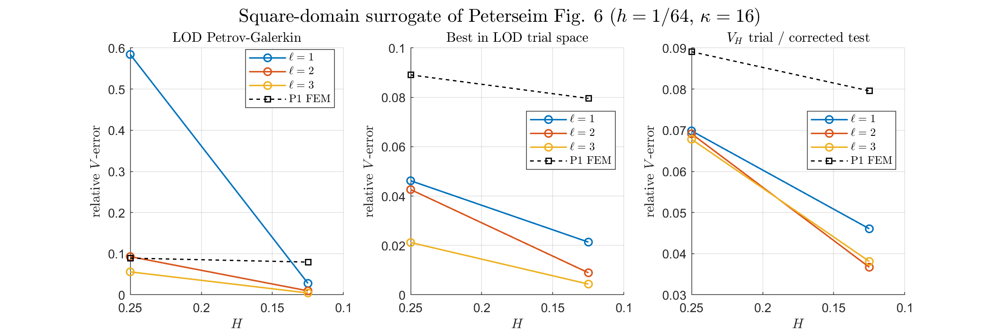

Reproduction target: Peterseim Figures 5-6 square-domain surrogate.
Created: 2026-05-26
Updated: 2026-05-26
Verification entry point: `verify/verify_lod_peterseim_fig56_square.m`
Main utilities: `buildLODHelmholtz2D`, `weightedClementP1`, `assembleHelmholtz2D`

# Peterseim Figure 5-6 Square-Domain Surrogate

This run follows the Figure 5-6 error-study pattern from Peterseim, but uses the normal square domain `Omega=(0,1)^2` with homogeneous impedance boundary conditions on the whole boundary. It does not include the paper's triangular scatterer.

Fine mesh rule: Lagrange degree `p=1`, `k_max=16`, require `h^{-1} >= 64` from `h = O(k^{-(2p+1)/(2p)})`; nested run uses `h=1/64`.

Default run: `h=1/64`, Figure 5 `H^{-1}=[2  4  8]`, `k=[4   8  16]`; Figure 6 `k=16`, `ell=[1  2  3]`.

## Figure 5 Data

| k | H^{-1} | ell | LOD | best LOD | stabilized | P1 | seconds |
|---:|---:|---:|---:|---:|---:|---:|---:|
| 4 | 2 | 1 | 2.975550e-02 | 2.925957e-02 | 1.227715e-01 | 1.257639e-01 | 2.51 |
| 4 | 4 | 2 | 1.540148e-02 | 1.532180e-02 | 7.800008e-02 | 7.349392e-02 | 3.16 |
| 4 | 8 | 3 | 6.736897e-03 | 6.729447e-03 | 3.826080e-02 | 3.795464e-02 | 6.42 |
| 8 | 2 | 1 | 2.633602e-02 | 2.429031e-02 | 9.707514e-02 | 1.316810e-01 | 1.74 |
| 8 | 4 | 2 | 1.028609e-02 | 9.978164e-03 | 8.299826e-02 | 1.112476e-01 | 3.06 |
| 8 | 8 | 3 | 3.518876e-03 | 3.501704e-03 | 3.907522e-02 | 5.151048e-02 | 6.41 |
| 16 | 2 | 1 | 1.358416e-01 | 6.589943e-02 | 8.394699e-02 | 8.443920e-02 | 1.73 |
| 16 | 4 | 2 | 9.286801e-02 | 4.263440e-02 | 6.913984e-02 | 8.908170e-02 | 3.08 |
| 16 | 8 | 3 | 4.462515e-03 | 4.341616e-03 | 3.810937e-02 | 7.956374e-02 | 6.37 |

## Figure 6 Data

| ell | H^{-1} | LOD | best LOD | stabilized | P1 | seconds |
|---:|---:|---:|---:|---:|---:|---:|
| 1 | 4 | 5.842350e-01 | 4.620907e-02 | 6.984904e-02 | 8.908170e-02 | 2.00 |
| 1 | 8 | 2.780523e-02 | 2.135124e-02 | 4.604841e-02 | 7.956374e-02 | 2.12 |
| 2 | 4 | 9.286801e-02 | 4.263440e-02 | 6.913984e-02 | 8.908170e-02 | 3.04 |
| 2 | 8 | 9.629751e-03 | 8.924904e-03 | 3.670205e-02 | 7.956374e-02 | 3.83 |
| 3 | 4 | 5.575188e-02 | 2.118494e-02 | 6.780707e-02 | 8.908170e-02 | 3.97 |
| 3 | 8 | 4.462515e-03 | 4.341616e-03 | 3.810937e-02 | 7.956374e-02 | 6.48 |
